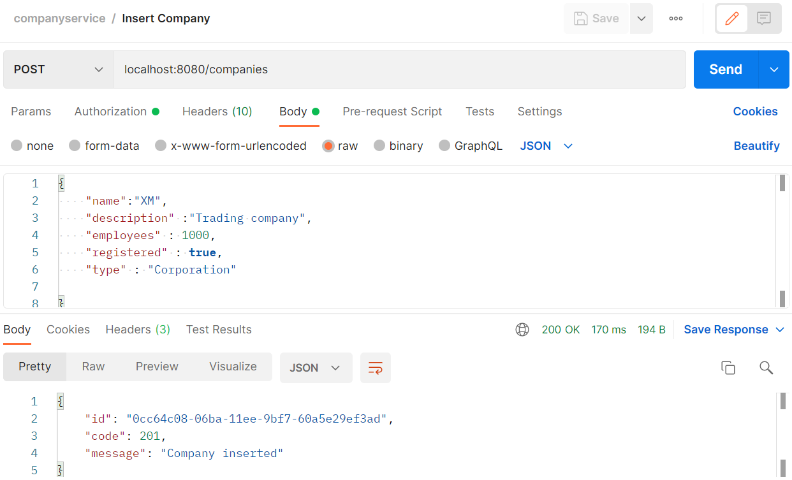
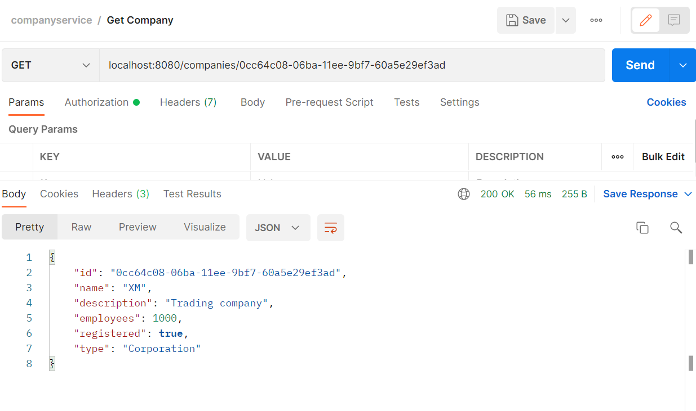
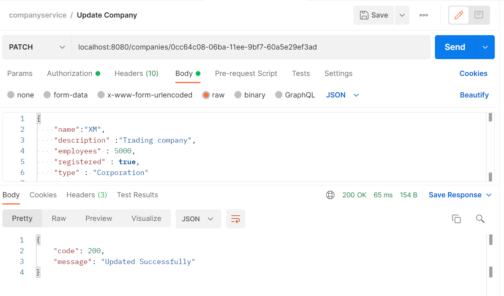
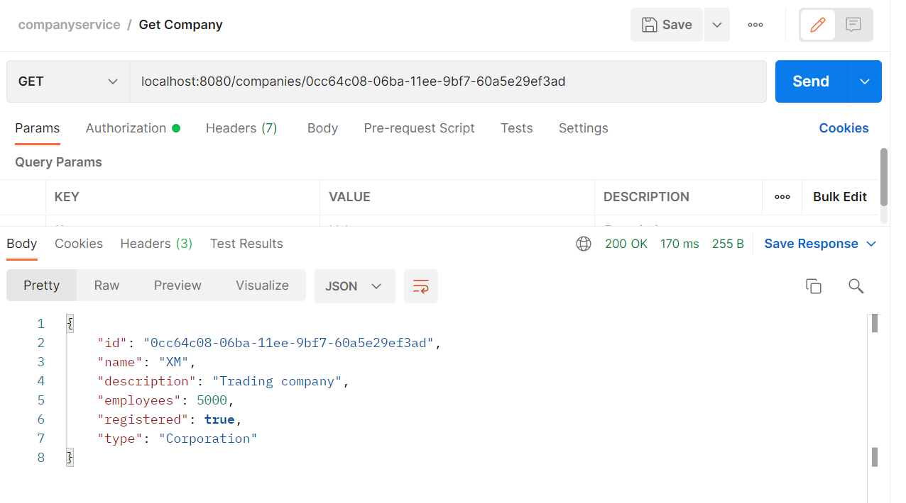
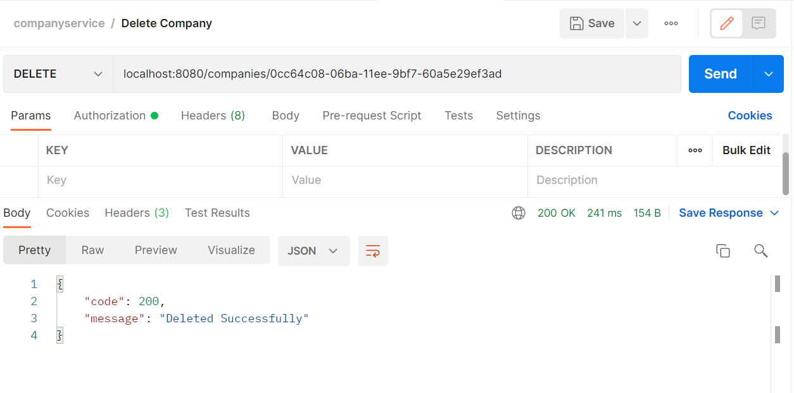
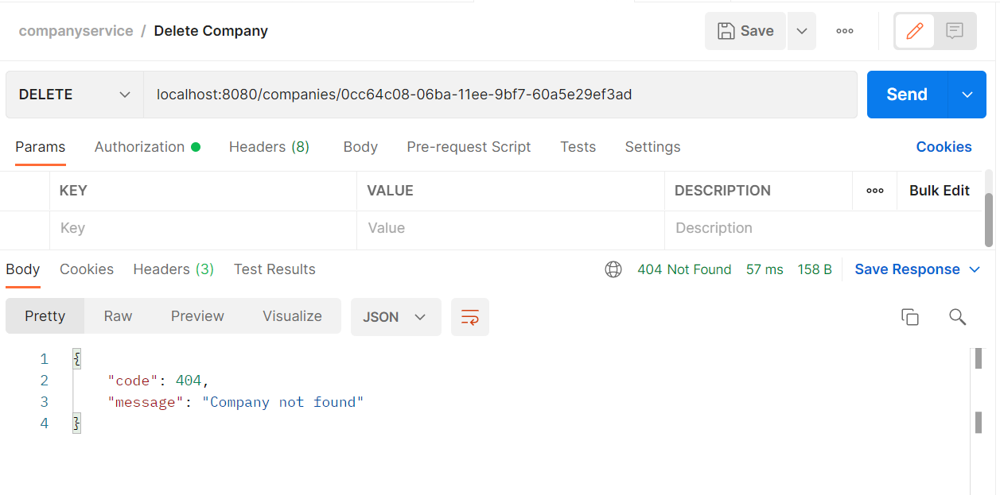

# Company Service

A microservice to handle companies. It provides the following operations:
• Create
• Patch
• Delete
• Get (one)


## Run Locally

Clone the project

```bash
  git clone https://github.com/jain-chetan/companyservice.git
```

Go to the project directory

```bash
  cd companyservice
```

Install dependencies

```bash
  go mod tidy
  go mod vendor
```

Start the server

```bash
  go run main.go
```

Run the APIs by hitting on Postman

{POST}/createtoken - generates token for a user to authenticate
{POST}/companies - to add company details
{GET}/companies/{id} - to get the company details based on the uuid provided
{PATCH}/companies/{id} - to update the company details based on the uuid provided
{DELETE}/companies/{id} - to delete the company details based on the uuid provided

## Tech Stack

Golang - go 1.18
PostgreSQl DB
Postman


# test results on postman






